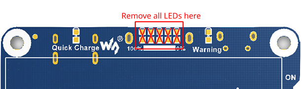
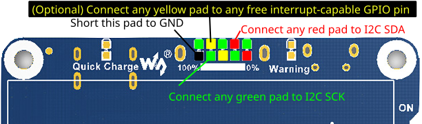

# What's this?
This is a small utility to inspect the status of a SW6106 device over an i2c bus, like this [Waveshare Li-ion Battery HAT](https://www.waveshare.com/li-ion-battery-hat.htm). This software was written with Raspberry Pi's in mind, but it should work with any device with an i2c bus.


# How to use?
*Make sure i2c is enabled in your system*
- Command line options:
  ```sh
  -h | --help :		print this help
  -s | --single-run :	query once and exit
  -i | --i2c_dev : 	override i2c device (will ignore similar option in config file)
  -c | --config :		set config path. Default value: /etc/sw6106mon.conf
  ```

- Report the current state of a device:
    ```sh
    sudo sw6106mon -s -i /dev/i2c-1
    sw6106 chip version 6
    
    -----
    10:16:05
    Status:
      USB type C port is connected
      Charger is connected
    
    Charge: 94%
    Battery voltage: 4222 mV
    Charge current: 264 mA
    ```


- As a system service that will initiate a graceful system shutdown once battery is discharged bellow certain threshold:
    - Edit `/etc/sw6106mon.conf`, set the i2c bus to look for a device, GPIO interrupt pin and the low voltage/charge percent threshold.
    - Enable `sudo systemctl enable sw6106mon.service` and start `sudo systemctl start sw6106mon.service`


For your convenience, the [init.d scipt](extra/sw6106mon-initd) is also avalilable.

# How to modify Waveshare Li-Ion battery HAT to expose I2C bus

If you look closer at the [SW6106 datasheet](doc/sw6106-datasheet.pdf) and [Waveshare Li-Ion HAT schematic](doc/Waveshare_Li-ion_Battery_HAT_Schematic.pdf), you can spot a LED/I2C interface, which is occupied by LEDs on Li-Ion HAT. Thus, it's rather easy to replace LEDs with I2C interface, like this:






# Build a package from source

```
# Install cmake and libgpiod packages
sudo apt install build-essential cmake libgpiod-dev

# Download the source
git clone git@github.com:BortEngineerDude/sw6106mon.git
cd sw6106mon

# Build the package
mkdir build
cd build
cmake ..
cpack -G DEB
```

